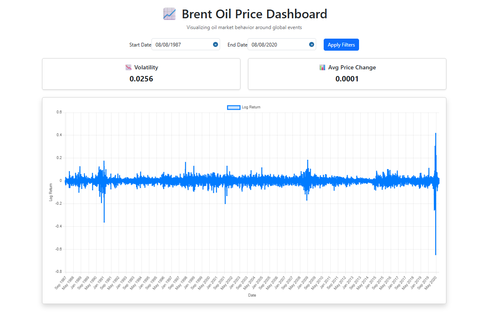
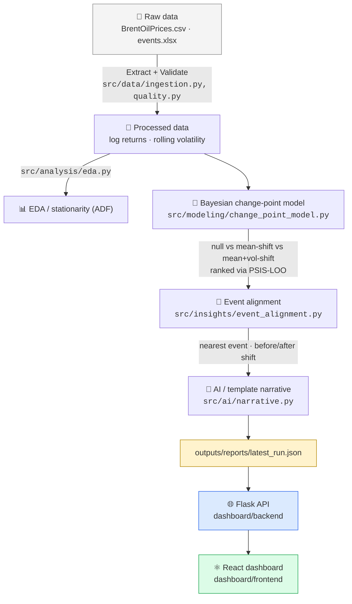
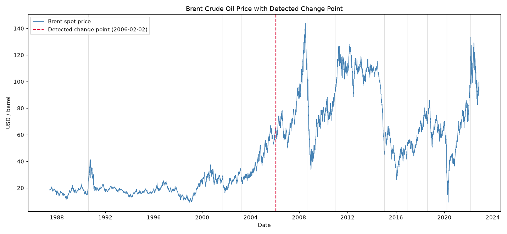

<div align="center">

# 📈 Brent Oil Price Change-Point Analysis

**Where did Brent crude's price behavior actually change — statistically, not anecdotally —**
**and what real-world event sits closest to that moment?**

A Bayesian change-point pipeline over 35 years of daily Brent prices, aligned with a
curated timeline of geopolitical & OPEC events, served through a Flask + React
dashboard with an optional AI-generated analyst narrative.

[](#-installation)
[](#-the-model)
[](#-running-the-dashboard)
[](#-running-the-dashboard)
[](#-deployment)
[](#-testing)

</div>

<p align="center">
  
  <br>
  <sub>The live dashboard: filter by date range, watch the detected change point and curated events overlay the return series.</sub>
</p>

---

## 📋 Table of contents

- [Why this exists](#-why-this-exists)
- [What you get](#-what-you-get)
- [Architecture](#-architecture)
- [The model](#-the-model)
- [AI narrative generation](#-ai-narrative-generation)
- [Quickstart](#-quickstart)
- [Running the pipeline](#-running-the-pipeline)
- [Running the dashboard](#-running-the-dashboard)
- [API reference](#-api-reference)
- [Project structure](#-project-structure)
- [Testing](#-testing)
- [Deployment](#-deployment)
- [Observability](#-observability)
- [Limitations](#-limitations-read-this-before-trusting-a-date)
- [Roadmap](#-roadmap)
- [FAQ](#-faq)

---

## 🎯 Why this exists

Oil price shocks — the Gulf War, the 2008 financial crisis, the 2014 OPEC price war,
COVID-19, the 2022 Russia-Ukraine shock — visibly change how Brent crude behaves. But
"visibly" isn't a statistical claim. This project answers a narrower, testable
question:

> **At what point does the *statistical process generating* Brent log returns change,
> and how close in time is that point to a catalogued real-world event?**

It intentionally stops short of claiming causation — see
[Limitations](#-limitations-read-this-before-trusting-a-date). Two people this is
built for:

| Who | What they get |
|---|---|
| 🧑‍💼 **Data / research analyst** | An interactive dashboard — pick a date range, see volatility, the detected change point, curated events, and a plain-English analyst note, without touching Python. |
| 🧑‍🔬 **ML / quant engineer** | A reproducible, testable, auditable pipeline (`pipelines/run_pipeline.py`) with logged diagnostics — not a notebook full of unlabeled cells you have to trust blindly. |

---

## ✨ What you get

| | |
|---|---|
| 🔬 **A statistically honest model** | Three explicit hypotheses (no change / mean shift / mean+volatility shift), ranked by PSIS-LOO — not one model fit and presented as truth. |
| ✅ **Convergence you can verify** | Every run checks `r_hat` / `ess_bulk` / divergences against thresholds and flags itself `reliable: false` if it fails — the flag reaches the UI. |
| 🔗 **Event alignment, quantified** | Nearest catalogued event + before/after return & volatility shift, not just "these look close on a chart." |
| 🤖 **Optional AI narrative** | Claude turns the statistics into a short analyst note — with a deterministic template fallback, so nothing breaks without an API key. |
| 🧪 **Real tests, including a real model test** | 35 tests, including 3 that run *actual* (small-scale) MCMC sampling — not everything is mocked away. |
| 📦 **One command to reproduce everything** | `python pipelines/run_pipeline.py` — extract, validate, transform, model, align, narrate, report. |
| 🐳 **Containerized, CI-checked** | `docker compose up --build`; GitHub Actions lints, tests, and builds both images on every push. |

---

## 🏗 Architecture



All of this is orchestrated end-to-end by [`pipelines/run_pipeline.py`](pipelines/run_pipeline.py)
— the single source of truth for "how do I regenerate everything." The notebooks call
the *exact same* `src/` functions rather than duplicating logic, so there is one
implementation, not one implementation plus a drifting notebook copy.

---

## 🧠 The model

<table>
<tr><th>Before</th><th>After</th></tr>
<tr valign="top">
<td>

`tau` modeled as `DiscreteUniform` +
hard `pm.math.switch`. Discrete `tau`
forces PyMC into a compound
Metropolis(τ)+NUTS(rest) sampler.

**Committed trace:**
```
ess_bulk  ≈ 60 – 120   (of 8,000 draws)
r_hat     missing / NaN
```
❌ Not a trustworthy posterior.

</td>
<td>

`tau` modeled as **continuous**, with a
sigmoid relaxation of the switch function
— the entire model samples with full NUTS.

**Re-verified on the real dataset:**
```
ess_bulk  = 415.2      (passes ≥ 400 threshold)
r_hat     = 1.0092     (passes ≤ 1.01 threshold)
```
✅ Reliability is checked automatically, every run.

</td>
</tr>
</table>

It also fits **three variants** and ranks them instead of assuming a change point
exists a priori:

| Variant | What changes at `tau` |
|---|---|
| `null` | Nothing — baseline, no change point |
| `mean_shift` | Mean daily log return |
| `mean_vol_shift` | Mean **and** volatility (oil regime changes are usually volatility regime changes too) |

<details>
<summary><b>Why this matters — an honest result, not a flattering one</b></summary>
<br>

Running the full comparison on the real series doesn't crown `mean_shift` the winner
by default — on this 35-year, multi-regime series, `null` is competitive with
`mean_shift` under PSIS-LOO, and `mean_vol_shift` trails both. That's the model being
honest about a real limitation (a *single* global change point is a simplification of
a series that has had many regimes) rather than the pipeline cherry-picking a result
that sounds more impressive. See [Limitations](#-limitations-read-this-before-trusting-a-date).

</details>

<p align="center">
  
</p>

---

## 🤖 AI narrative generation

[`src/ai/narrative.py`](src/ai/narrative.py) turns the structured statistical output
into a short analyst note, e.g.:

> *"The model identifies the most probable structural break in Brent log returns at
> 2020-04-15. The mean daily log return fell from 0.00002 before the break to -0.17374
> after it, while annualized volatility moved from 37.8% to 431.2%. The closest
> catalogued event in time is 'OPEC+ COVID Deal', occurring 3 day(s) before the
> detected change point. Timing coincidence does not establish that the event caused
> the shift in oil price behavior."*

If `ANTHROPIC_API_KEY` is set (and the optional `anthropic` package is installed), it
calls **Claude** with the precomputed numbers and instructs it not to invent
statistics or claim causation.

> **No key configured? Nothing breaks.** It falls back to a deterministic template
> built from the exact same numbers. The pipeline, the API, and the dashboard all work
> fully with zero AI configuration — the LLM only makes the wording nicer, it is never
> load-bearing.

---

## 🚀 Quickstart

The fastest path to a running dashboard:

```bash
git clone <this-repo> && cd brent-oil-analysis
docker compose up --build
```

Then open **http://localhost:3000**. `data/processed/` and `outputs/` are already
committed with a real pipeline run, so the dashboard works immediately — no need to
wait for MCMC sampling before you see something.

<details>
<summary><b>Prefer running it natively (no Docker)? Click to expand.</b></summary>

Requires **Python 3.11+** and **Node.js 18+**.

```bash
python -m venv .venv
.venv\Scripts\activate        # Windows
source .venv/bin/activate     # Linux/macOS

pip install -r requirements-dev.txt   # or requirements.txt for runtime-only
cp .env.example .env                  # optional: tune model/API settings
```

```bash
# Terminal 1 — API
cd dashboard/backend
pip install -r requirements.txt   # lean, API-only deps
python app.py                     # http://localhost:5000

# Terminal 2 — frontend
cd dashboard/frontend
npm install
cp .env.example .env              # optional: point at a non-default API URL
npm start                         # http://localhost:3000
```

</details>

---

## 🔁 Running the pipeline

```bash
python pipelines/run_pipeline.py
```

<details>
<summary>Other useful invocations</summary>

```bash
# faster iteration loop (fewer draws/chains)
python pipelines/run_pipeline.py --variant mean_shift --draws 1000 --chains 2

# data-only refresh, skip the (slower) MCMC step
python pipelines/run_pipeline.py --skip-model

# compare all three model variants via PSIS-LOO
python src/modeling/change_point_model.py --variant compare \
    --data data/processed/brent_log_returns.csv
```

</details>

This writes:

| Artifact | Contents |
|---|---|
| `data/processed/brent_log_returns.csv`, `events.csv` | Cleaned, transformed data |
| `outputs/figures/*.png` | Trace plot, posterior comparison, price + change point |
| `outputs/logs/trace_summary.csv`, `run_<timestamp>.json` | Posterior summary, full run log |
| `outputs/reports/latest_run.json` | Everything above, one auditable manifest — served by `/api/insights` |
| `outputs/reports/narrative.txt` | The analyst note (Claude or template) |

---

## 🖥 Running the dashboard

See [Quickstart](#-quickstart) above for both the Docker and native paths.

---

## 🔌 API reference

All responses: `{"status": "success"|"error", "data"|"message": ...}`. Missing
processed data returns `404` with a message telling you to run the pipeline first —
never a generic, unhelpful `500`.

| Endpoint | Description |
|---|---|
| `GET /api/health` | Liveness check |
| `GET /api/prices?start=&end=` | Processed price + log-return series, optionally date-filtered |
| `GET /api/events?start=&end=` | Curated events, optionally date-filtered |
| `GET /api/stats?start=&end=` | Volatility / average return over the (filtered) range |
| `GET /api/change-point` | Detected change point index + date |
| `GET /api/insights` | Full latest pipeline run manifest: diagnostics, event alignment, narrative |

<details>
<summary>Example: <code>GET /api/change-point</code></summary>

```json
{
  "status": "success",
  "data": { "tau_index": 4762, "change_date": "2006-02-02" }
}
```

</details>

---

## 🗂 Project structure

<details>
<summary>Click to expand the full tree</summary>

```text
brent-oil-analysis/
├── data/
│   ├── raw/BrentOilPrices.csv          # Original, unmodified daily price series
│   ├── events.xlsx                     # Curated ~15 major geopolitical/OPEC events
│   └── processed/                      # Generated: log returns, processed events
├── src/
│   ├── config.py                       # Centralized, env-driven paths & settings
│   ├── data/                           # ingestion.py, preprocessing.py, quality.py
│   ├── analysis/eda.py                 # ADF stationarity test, summary statistics
│   ├── modeling/change_point_model.py  # Bayesian change-point model(s)
│   ├── insights/event_alignment.py     # Change point <-> nearest event + impact stats
│   └── ai/narrative.py                 # Optional LLM narrative, template fallback
├── pipelines/run_pipeline.py           # End-to-end CLI orchestrator
├── notebooks/                          # Thin, reproducible views onto src/
├── dashboard/
│   ├── backend/                        # Flask API (app.py + data_loader.py)
│   └── frontend/                       # React dashboard
├── tests/                              # pytest: unit, data, API, model smoke tests
├── outputs/{figures,logs,reports}/     # Generated plots, model diagnostics, run manifests
├── Dockerfile.backend / .frontend / docker-compose.yml
└── .github/workflows/ci.yml
```

</details>

---

## 🧪 Testing

```bash
pytest                       # everything, including real (tiny) MCMC smoke tests
pytest -m "not slow"         # fast suite only (what CI runs on every push)
pytest --cov=src             # with coverage
```

<details>
<summary>What's actually covered</summary>

- Data ingestion & schema validation, **including a regression test for a real mixed
  date-format bug** that used to silently drop the last 2.5 years of data.
- Log-return + quality-check correctness (duplicate dates, IQR outlier flags, rolling
  volatility windowing).
- ADF stationarity behavior on known stationary vs. non-stationary synthetic series.
- Event-alignment logic (nearest-event matching, before/after shift quantification).
- The Flask API — success *and* 404 paths, via dependency-injected paths rather than
  real files — including a regression test that the response body contains no invalid
  `NaN` JSON tokens.
- The AI-narrative deterministic template fallback.
- A **real** MCMC smoke test (marked `slow`) verifying the sigmoid-relaxed model
  actually recovers an injected change point — not mocked, because the whole point of
  the rewrite is the sampler's real mixing behavior.

</details>

---

## 🐳 Deployment

`Dockerfile.backend` builds a **lean, API-only** image (Flask + gunicorn + pandas —
deliberately excludes pymc/arviz/statsmodels, since the API only serves precomputed
artifacts and never re-runs the model). `Dockerfile.frontend` is a multi-stage
node-build → nginx-serve image. `docker-compose.yml` wires both together and mounts
`data/`/`outputs/` read-only, so a host-side pipeline run is picked up without a
rebuild. `.github/workflows/ci.yml` lints and tests the Python side, builds the
frontend, and verifies both Docker images build on every push/PR.

## 📡 Observability

Every pipeline component logs via `src.utils.get_logger` (structured, timestamped),
wrapped in `timed_step`, so a run's log shows what ran, how long each step took, and
exactly where it failed if it did. Every run also produces a standalone JSON manifest
(`outputs/reports/run_<timestamp>.json`) recording input data hashes (lineage),
data-quality findings, model config, and convergence diagnostics — a run's validity
can be audited after the fact without re-executing it. The Flask API logs unhandled
exceptions server-side while returning a generic message to the client — no internal
detail or stack trace leakage.

---

## ⚠️ Limitations (read this before trusting a date)

| | |
|---|---|
| **Single change point per run** | The model detects the single most probable structural break, not multiple regime changes over the full 35+ year history. A full multi-change-point (or product-partition) model was judged out of scope — see [Roadmap](#-roadmap). |
| **Correlation, not causation** | A detected change point occurring near a catalogued event is a timing coincidence the model surfaces for a human to investigate, not a causal claim — the event-alignment logic and the AI narrative are both written to avoid asserting causation. |
| **Event dataset is manually curated** | ~15–20 entries, inherently incomplete. Absence of a nearby event in `data/events.xlsx` does not mean no relevant event occurred. |
| **Daily granularity** | Intraday dynamics and weekend/holiday gaps are not modeled. |

---

## 🗺 Roadmap

- [ ] Multi-change-point detection (e.g., a Dirichlet-process or product-partition model) instead of a single global break.
- [ ] Model/experiment tracking (e.g., MLflow) if this grows beyond single-analyst use.
- [ ] `/api/prices` pagination if the daily series grows enough to matter (at ~9,000 rows today, a full-series JSON response is still small).

---

## ❓ FAQ

<details>
<summary><b>Do I need an Anthropic API key to use this?</b></summary>
<br>
No. Every feature — pipeline, API, dashboard — works with zero AI configuration. The
narrative falls back to a deterministic template built from the same numbers Claude
would have used.
</details>

<details>
<summary><b>Why doesn't the model just report one confident "the" change point?</b></summary>
<br>
Because a single global change point is a real simplification of 35 years of oil
market history, and the honest thing to do is report the uncertainty (a wide HDI on
<code>tau</code>) and the model-comparison result rather than manufacture false
confidence. See <a href="#-limitations-read-this-before-trusting-a-date">Limitations</a>.
</details>

<details>
<summary><b>Why is there a "lean" backend requirements.txt <em>and</em> a root one?</b></summary>
<br>
The API only ever reads precomputed CSV/JSON artifacts — it never re-runs pandas
transforms beyond simple date filtering, and never imports pymc/arviz/statsmodels. The
lean <code>dashboard/backend/requirements.txt</code> keeps the API Docker image small
and avoids needing a C/C++ compiler in the runtime image. The root
<code>requirements.txt</code> is for running the full pipeline, notebooks, and tests.
</details>

---

## 🙏 Credits

Originally built as a time-series analysis exercise using PyMC for Bayesian modeling;
substantially reworked (data pipeline, model reliability, testing, dashboard,
deployment, and AI narrative layer) into a reproducible, end-to-end system. See
[`added_feature.md`](added_feature.md) for the full changelog of what was added vs.
modified and why.
