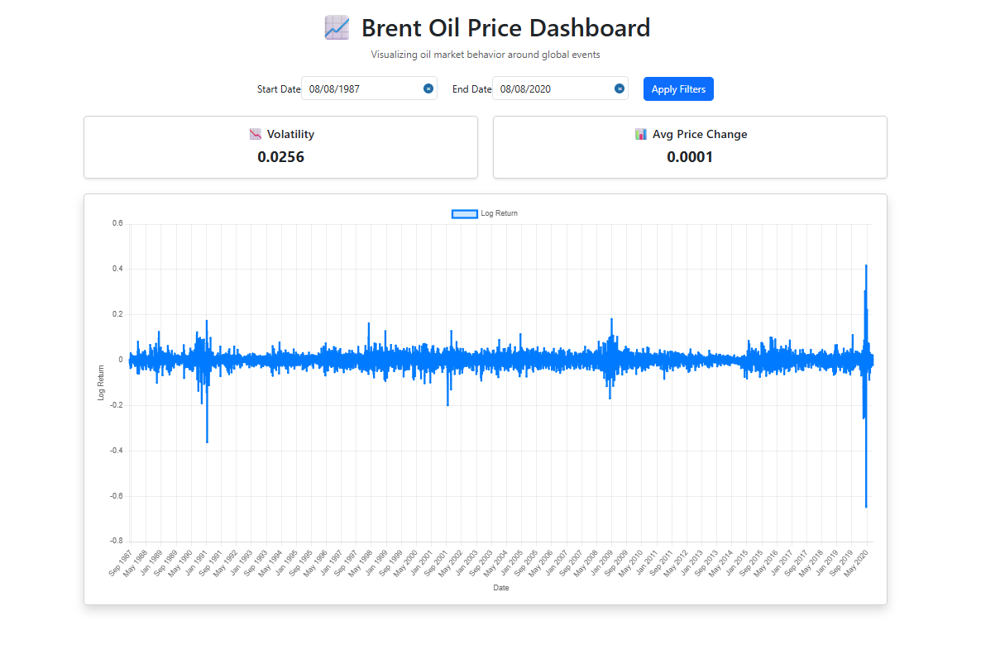

# 📈 Brent Oil Price Change Point Analysis

## 🧠 Project Overview

This project investigates how significant geopolitical and economic events influence **Brent crude oil prices** using **Bayesian change point detection**. The objective is to:

* Detect **structural shifts** in the oil price time series,
* Statistically **quantify these changes**, and
* Correlate them with real-world **events** such as wars, OPEC decisions, pandemics, and sanctions.

The analysis is divided into multiple tasks covering data cleaning, exploratory data analysis (EDA), modeling, and insights generation.

---

## 📂 Project Structure

```plaintext
brent-oil-analysis/
│
├── data/
│   ├── raw/                        # Original unmodified files
│   │   └── BrentOilPrices.csv
│   ├── processed/                  # Cleaned & transformed data
│   │   └── brent_log_returns.csv
│   └── events.csv                 # Structured dataset of global events
│
├── notebooks/
│   ├── 01_eda.ipynb               # EDA + Stationarity checks
│   ├── 02_change_point_model.ipynb# PyMC Change Point Modeling
│   └── 03_dashboard_logic.ipynb   # Dashboard idea & logic
│
├── src/
│   ├── __init__.py
│   ├── data_preprocessing.py      # (optional) reusable data cleaning functions
│   ├── change_point_model.py      # PyMC modeling pipeline
│   └── utils.py                   # Any shared helper functions
│
├── outputs/
│   ├── figures/                   # Generated plots
│   └── logs/                      # Posterior summary, diagnostics
│
├── reports/
│   ├── interim_report.pdf         # Task 1 summary
│   └── final_report.pdf           # Final analysis report
│
├── dashboard/
│   ├── backend/                   # Flask backend API
│   │   └── app.py
│   └── frontend/                  # React dashboard frontend
│       └── (React project files)
│
├── requirements.txt
├── README.md
└── .gitignore
```

---

## 💻 Setup Instructions

### 1. Clone the repository

```bash
git clone https://github.com/your-username/brent-oil-analysis.git
cd brent-oil-analysis
```

---

### 2. Backend Setup (Flask API)

1. **Create and activate a Python virtual environment** (recommended):

```bash
python -m venv venv
source venv/bin/activate     # Linux/macOS
# OR
venv\Scripts\activate        # Windows PowerShell
```

2. **Install backend dependencies:**

```bash
pip install -r requirements.txt
```

3. **Run the Flask backend server:**

```bash
cd dashboard/backend
export FLASK_APP=app.py      # Linux/macOS
set FLASK_APP=app.py         # Windows PowerShell
flask run
```

The backend server will start on `http://localhost:5000` by default.

---

### 3. Frontend Setup (React)

1. **Navigate to the frontend directory:**

```bash
cd dashboard/frontend
```

2. **Install frontend dependencies:**

```bash
npm install
```

3. **Start the React development server:**

```bash
npm start
```

The frontend will launch on `http://localhost:3000` by default and will communicate with the backend API at `http://localhost:5000`.

---

### 4. Access the Dashboard

Open your browser and go to:

```
http://localhost:3000
```

to see the interactive Brent Oil Price Dashboard.

---

## 🧾 Requirements

```txt
pandas
numpy
matplotlib
seaborn
statsmodels
pymc
arviz
flask
```

*Note: Backend requires Python dependencies listed above. Frontend requires Node.js and npm.*

---

## 📷 Web Dashboard Screenshots



---

## ✅ Task 1: Data Preparation & EDA

### Objective

* ✅ Load and clean raw Brent oil price data.
* ✅ Calculate **log returns** to stabilize variance and ensure stationarity.
* ✅ Visualize price trends and returns.
* ✅ Apply **ADF test** to confirm stationarity.
* ✅ Compile structured **event dataset** with at least 15 major global/oil events.

### Steps to Run

1. **Place** raw price file: `data/raw/BrentOilPrices.csv`
2. **Run**: `/notebooks/01_eda.ipynb`
3. **Output**: `data/processed/brent_log_returns.csv`
4. **Review**:

   * Stationarity test (ADF)
   * Raw & log return plots
5. **Create/Edit**: `data/events.csv` with:

   * Event name
   * Start date
   * Description
   * Region
   * Type (e.g., Conflict, OPEC, Sanction)

---

## 🧪 Assumptions & Limitations

| Area                       | Detail                                                                               |
| -------------------------- | ------------------------------------------------------------------------------------ |
| 📉 Stationarity            | Log returns are assumed stationary. Confirmed using ADF test.                        |
| 🔀 Model Simplicity        | Basic change point model assumes **one change** in mean only.                        |
| 🔍 Correlation ≠ Causation | Detected change points align with known events, but **causality is not guaranteed**. |
| 📅 Temporal Resolution     | Event dates may not align exactly with statistical shifts.                           |
| 📊 Prior Assumptions       | Uniform prior for change point location. Normal priors for mean/volatility.          |

---

## 🧮 Task 2: Bayesian Change Point Modeling (PyMC)

### Goals

* Apply **Bayesian inference** to detect significant changes in oil price behavior.
* Use a **switch function** to detect shift in the mean log return before and after an unknown change point `τ`.
* Compare with `events.csv` to generate **hypotheses** on causal factors.
* **Quantify change**: e.g., “Mean daily return rose by 0.03 post-OPEC cut on \[date].”

### How to Run

1. Run script directly:

```bash
python src/change_point_model.py --data data/processed/brent_log_returns.csv --output outputs/
```

2. Or explore in the notebook:

```python
/notebooks/02_change_point_model.ipynb
```

3. Outputs:

   * Trace plots: `outputs/figures/`
   * Posterior summary: `outputs/logs/trace_summary.csv`
   * Change point date printed in console

---

## 🧭 Next Steps

* ✅ Task 1: EDA + Event Collection
* ✅ Task 2: Bayesian Modeling & Interpretation
* ⏳ Task 3: Align change points with events & deploy insights in a dashboard (Flask + React)
* 🧠 Advanced Models (optional): VAR, Markov Switching, multi-point detection

---

## 📌 Credits

This project was developed as part of a time series analysis module using PyMC for Bayesian modeling. Inspired by real-world oil market dynamics and macroeconomic influences.

---
